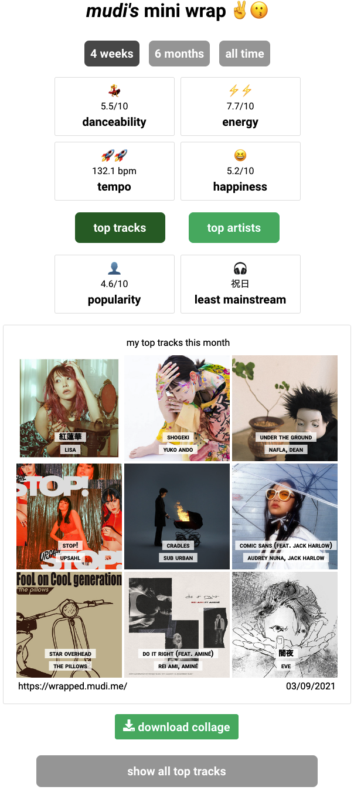

<!-- PROJECT LOGO -->
<br />
<p align="center">
  
  <h3 align="center">Mini Wrap for Spotify</h3>

  <p align="center">
    A [web application](https://wrapped.mudi.me/) that uses Spotify's Web API to generate a collage for your top tracks & top artists and display audio features.
    <br />
</p>


### Built With

* [Spotify Web API](https://developer.spotify.com/)
* [React](https://github.com/facebook/react)
* [Redux (update soon)](https://github.com/reduxjs/redux)
* [Flask](https://github.com/pallets/flask)
* [Axios](https://github.com/axios/axios)
* [React Grid Gallery](https://github.com/benhowell/react-grid-gallery)
* [html2canvas](https://github.com/niklasvh/html2canvas)


<!-- GETTING STARTED -->
## Getting Started

To get a local copy up and running follow these simple steps.


### Installation

1. Clone the repo
   ```sh
   git clone git@github.com:mudassarzahid/miniwrap.git
   ```
2. Create a virtual environment for the backend and activate it
   ```sh
   cd backend
   python3 -m venv venv
   source venv/bin/activate
   ```
3. Install required modules and run the backend
   ```sh
   pip install -r requirements.txt
   python app.py
   ```
4. Open another tab for the frontend, install required modules and run the frontend
   ```sh
   cd webapp
   yarn install
   yarn start
   ```


<!-- USAGE EXAMPLES -->
## Usage example




<!-- CONTACT -->
## Contact

Mudassar Zahid - [@mudassar_z](https://twitter.com/mudassar_z) - mudassar.ahmad.zahid@gmail.com

Project Link: [https://github.com/mudassarzahid/miniwrap](https://github.com/mudassarzahid/miniwrap)

